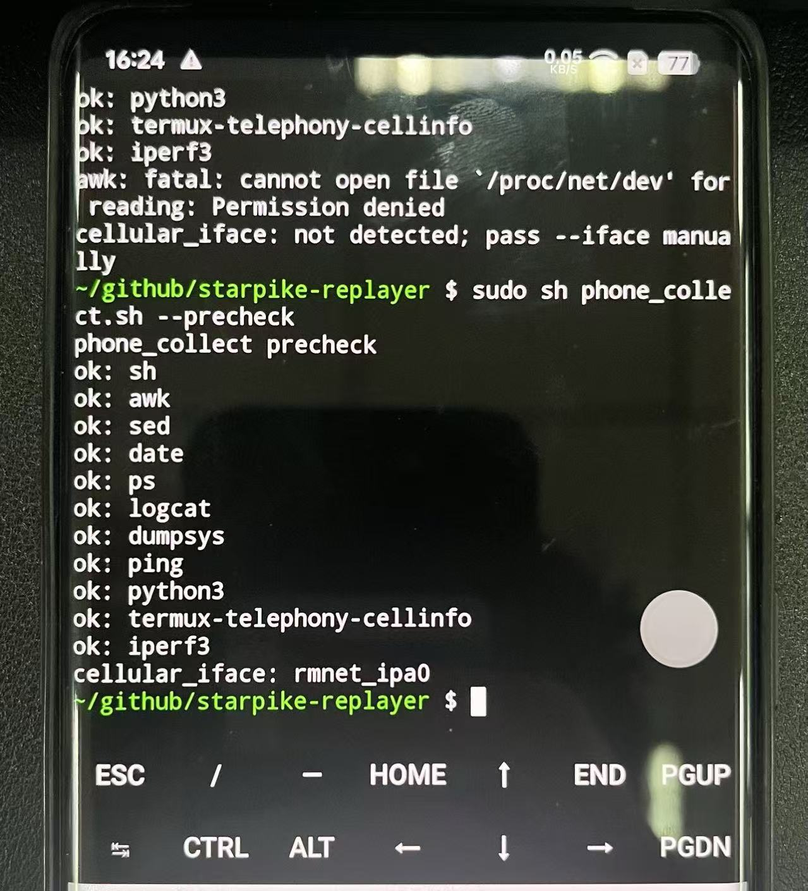
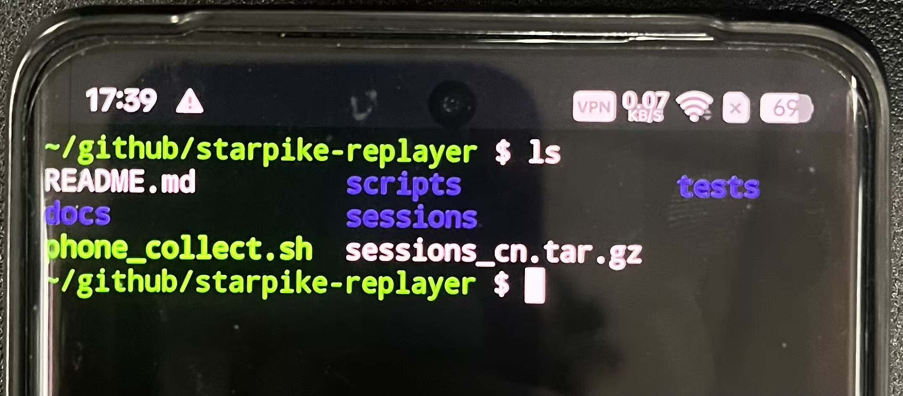

# 一加手机 + 无线网 smoke test

> 没有sim, 接无线网, 安卓, 已root

**(1) 进入 termux, 安装环境:**

```sh
pkg update
pkg install python termux-api iperf3
```

**(2) 前置检查:**

```sh
cd starpike-replayer
su -c id
cat /proc/net/dev # 会显示 wlan0
```

本次测试后面网口用 `--iface wlan0`

蜂窝测试如果同时想记录多个 rmnet 接口，可以用逗号分隔，例如：

```sh
--iface rmnet_data3,rmnet_ipa0
```

不要把 VPN 虚拟口 `tun0` 加进去。

```sh
sh phone_collect.sh --precheck
```

会得到:



表示一切就绪 :)

**(3) 实际运行:**

```sh
sh phone_collect.sh \
    --phase dtc_tcp \
    --duration 30 \
    --tcp-host 1.1.1.1 \
    --tcp-port 443 \
    --out ./sessions \
    --iface wlan0
```

会得到:

```sh
sessions/dtc_tcp_xxxxx/
    manifest.json
    precheck.log
    collector.log
    raw/proc_stat.tsv
    raw/proc_pid_stat.tsv
    raw/netdev.tsv
    raw/radio.log
    raw/telephony_snapshots.log
    raw/system_context.log
    raw/tcp_rtt.csv
```

打包数据: `tar -czf sessions_jp.tar.gz sessions`



**(4) 回传数据至电脑**

\[1\] 在 termux 中输入: `termux-setup-storage`

手机会弹权限，点击"允许".

\[2\] 拷贝至用户"文件管理":

```sh
cp sessions_jp.tar.gz /sdcard/Download/
```

\[3\] 拷贝至电脑:

* usb 线 / u 盘 / ...
* 文件传输助手 / telegram / ...

**(5) 电脑端: 离线分析/整理/绘图**

feel free to customize :)

目前我的默认绘图方式是:

```sh
python scripts/analyze_sessions.py \
  --session sessions/dtc_iperf_* \
  --out results
```
