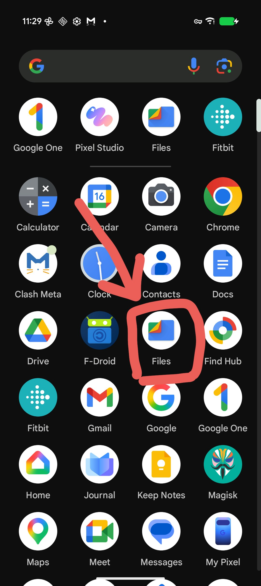
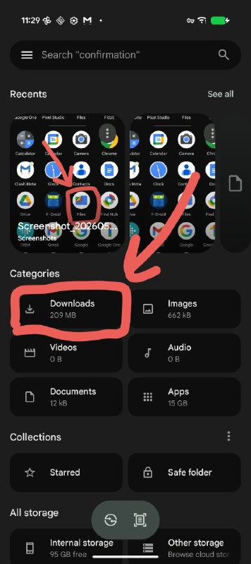
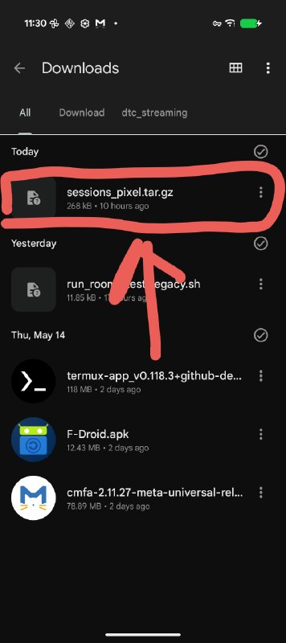
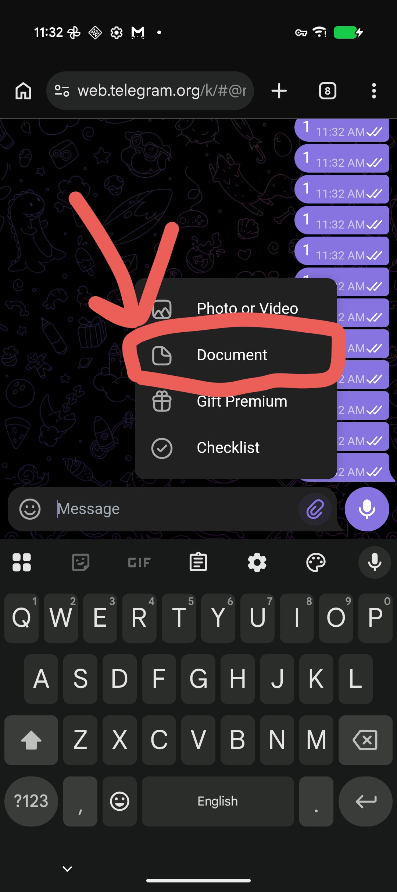
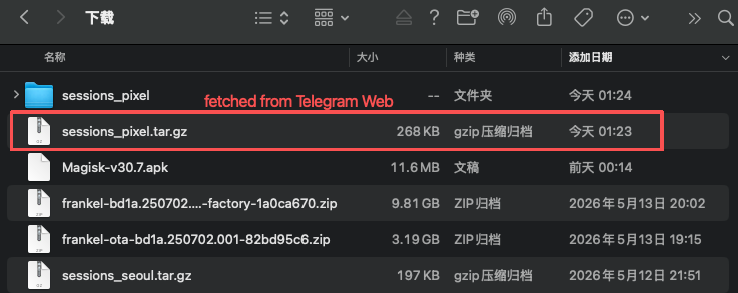

# Pixel 实验方法

**(0) Before Everything**

公网服务器:

```sh
# oracle seoul server
129.154.215.71
```

SIM卡:

au / docomo / softbank, "推荐" docomo

VPN: 确保关闭

JP测试, 不要开 clash

**(1) 前置检查:**

```sh
su -c 'cd /data/data/com.termux/files/home/starpike-replayer && PATH=/system/bin:/system/xbin:/data/data/com.termux/files/usr/bin:$PATH sh phone_collect.sh --precheck'
```

网络连通性验证:

```sh
# Step1: 在 oracle server 上 `iperf3 -s`
# Step2: pixel打流, 指令如下
su -c 'PATH=/system/bin:/system/xbin:/data/data/com.termux/files/usr/bin:$PATH iperf3 -c 129.154.215.71 -t 5 -i 1 -b 256K'
```

**(2) Smoke Test: 30s + WiFi + VPN-Off**

> 这一部分流程的产出, 对应文件夹下 wifi-example-output. 作为样例, 便于上手 :))

把 clash meta for android 代理应用关了!

这里我是用wifi测的, 仅供参考测试指令:

```sh
su -c 'cd /data/data/com.termux/files/home/starpike-replayer && PATH=/system/bin:/system/xbin:/data/data/com.termux/files/usr/bin:$PATH sh phone_collect.sh --phase wifi_iperf_smoke --duration 30 --iperf-server 129.154.215.71 --iperf-bw 256K --out ./sessions_smoke --iface wlan0 --enable-pixel-context --enable-signal-samples --enable-radio-events'
```

* `--phase wifi_iperf_smoke`: 本地测试名
* `--duration 30`: 测试时长
* `--iperf-server 129.154.215.71`: 指定服务器公网IP (此处指 oracle seoul server)
* `--out ./sessions_smoke`: 输出文件夹名称
* `--iface wlan0`: 指定测试网口! 
    * 此处指定 `wlan0` 是因为现在用wifi测
    * 后面用sim卡的话, 要改"测试网口". (下面会详细展开)
* 后面三个`enable`: 非常关键, 针对信令层交互. 不用管, 开着就行

\[1\] 打包内容:

```sh
tar -czf sessions_smoke.tar.gz sessions_smoke
```

\[2\] 把"压缩包"放到手机的Download下:

```sh
cp sessions_smoke.tar.gz /sdcard/Download
```







\[3\] 把"压缩包"通过telegram等方式回传给电脑, 后续离线分析:

> Telegram只是一种方式, 其他形如: U盘拷贝、USB线传输、LocalSend... 都可以






